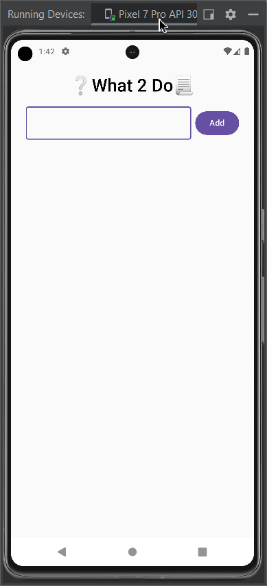

 📝 **My Todo App**  

A simple todo app built with **Kotlin** and **Jetpack Compose**.  

 🚀 **Getting Started**  

 **Prerequisites:**  
* 🛠️ **Android Studio**  
* 👨‍💻 **Software Development Kit (SDK)**  

 **Installation:**  
1️⃣ Clone the repository: `https://github.com/DopeDev32/MyTODO_App.git`  
2️⃣ Open the project in **Android Studio**.  

 🏗️ **Build Instructions**  
1️⃣ Build the project using **Gradle**: `./gradlew assembleDebug`  

 📱 **Running the App**  
1️⃣ Run the app on an **emulator** or a **physical device**.  

 📋 **Usage**  

 **Features:**  
* ➕ Add new todo items.    
* 🗑️ Delete todo items.  
  
<!--
### **Screenshots:**  
📸 [Include screenshots or GIFs here]  
-->

## 🤝 **Contributing**  

 **Guidelines:**  
* 🍴 Fork the repository.  
* 🌿 Create a new branch for your changes.  
* 🔄 Submit a pull request.  

 📧 **Contact**  
✉️ [debashisgope01@gmail.com]  

